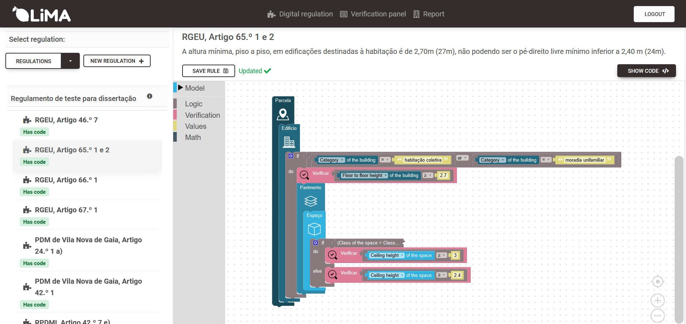

# LiMA

## Overview

This repository hosts the prototype of a digital platform designed to automate the creation of digital regulations for the Digital Building Permits use-case. Using open-source technologies, and therefore openBIM, it enables the creation of machine-interpretable regulations through a block-based visual language and performs compliance checks using Industry Foundation Classes (IFC) models. This project aims to streamline and digitize the permit process, enhancing efficiency and accuracy by leveraging Building Information Modeling (BIM) technologies.



## Features

- **Machine-Interpretable Regulations**: Allows for the creation of digital regulations using a visual programming interface.
- **Compliance Checks**: Automated verification of IFC models against established regulations to ensure compliance.
- **Open-Source Technologies**: Developed with a commitment to open standards and interoperability within the BIM ecosystem.
- **User-Friendly Interface**: A web-based platform designed for ease of use by municipal technicians and professionals, regardless of their programming expertise.

## Getting Started

### Prerequisites

- Docker
- Python 3.x
- Node.js

### Installation

1. Clone the repository:
   ```
   git clone https://github.com/Muniz1994/LiMA
   ```
2. Navigate to the project directory and build the Docker container:
   ```
   docker-compose up --build
   ```

### Usage

1. Access the web interface at `localhost:8000`.
2. Follow the on-screen instructions to create digital regulations and upload IFC models for compliance checks.

## Contributing

Contributions to the project are welcome! Please refer to the CONTRIBUTING.md file for guidelines on how to make contributions.

## License

This project is licensed under the MIT License - see the LICENSE file for details.


## Folder structure

```python
LiMA/
├── backend/
│   ├── autentic/ # Django app for atentication
│   ├── backend/ 
│   ├── check_module/ # Python module to execute the verifications based on the digital regulations and the IFC modules
│   ├── digital_regulation/ # Django app that handles the digital regulation creation
│   ├── media/ # Folder to manae static files
│   ├── verification/ # Django app that handles the model checking
│   ├── Dockerfile 
│   ├── manage.py
│   └── requirements.txt
├── client/
│   ├── public/
│   ├── src/

│   ├── .dockerignore
│   ├── .gitignore
│   ├── Dockerfile
│   ├── package.json
│   ├── README.md
│   └── model_a.py # Contains a class to represent a model
├── .gitignore
├── docker-compose.yaml
└── README.md

```